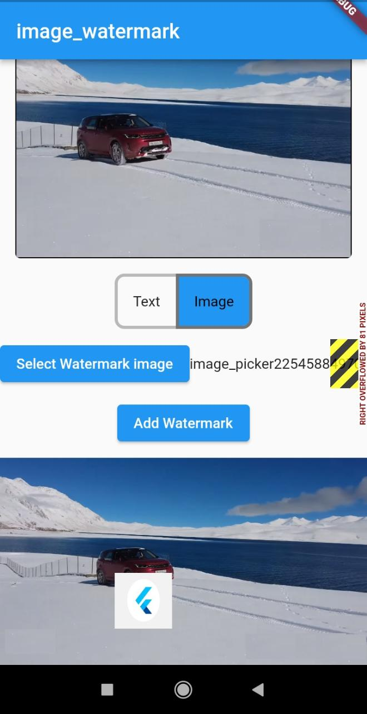

# image_watermark

Image watermark is pacakge to add text on image,you can customize the position of watermark and color.
Check on pub.dev:
https://pub.dev/packages/image_watermark

## Example code
```
var watermarkedImg = await image_watermark.addTextWatermark(
                          imgBytes,             //image bytes
                          'watermarkText',      //watermark text
                          color: Colors.green, //default : Colors.white
                          dstX: 20,         // default : imageWidth/4
                          dstY: 30);        // default : imageWidth/2
```

